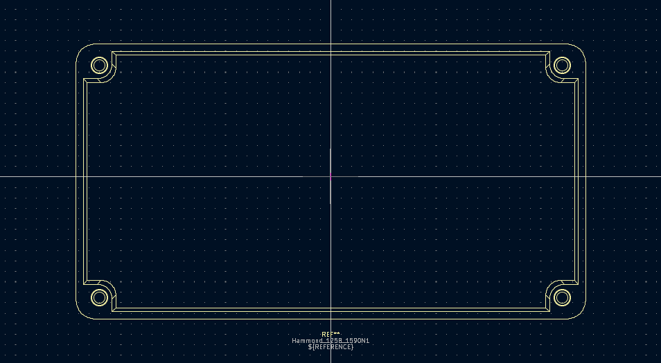
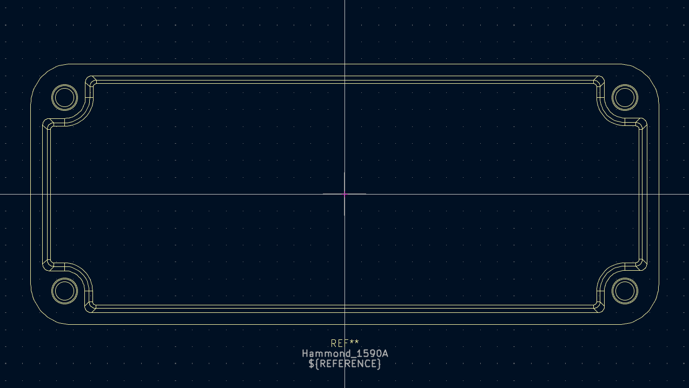
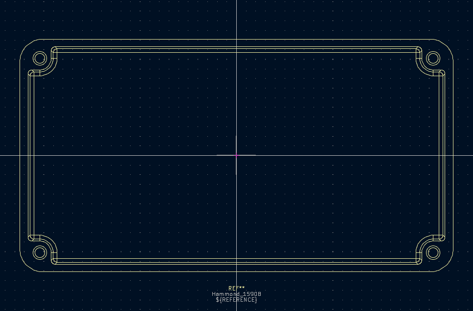
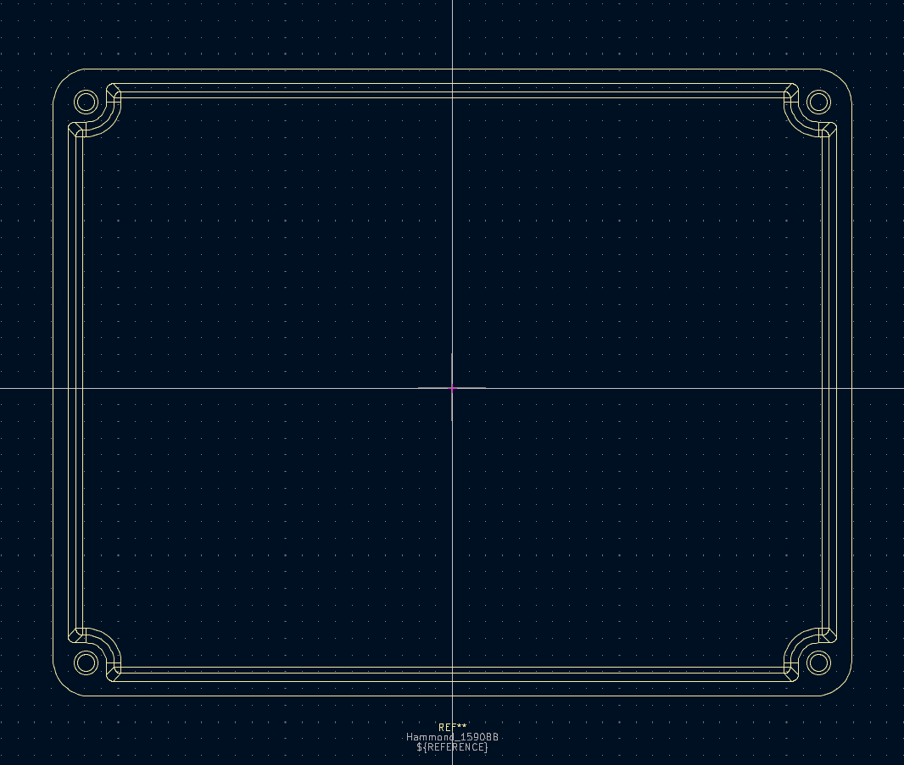
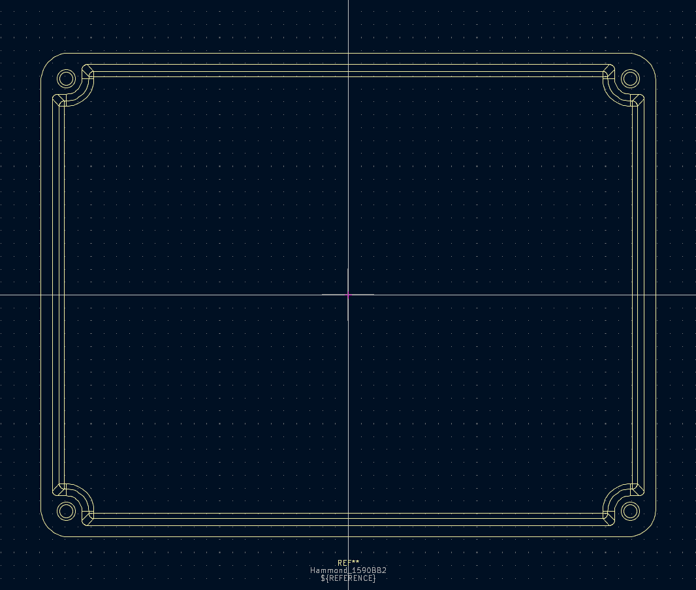
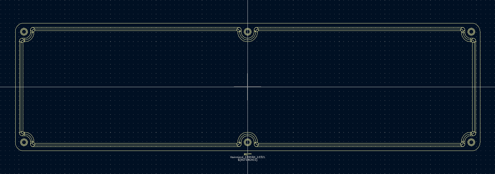
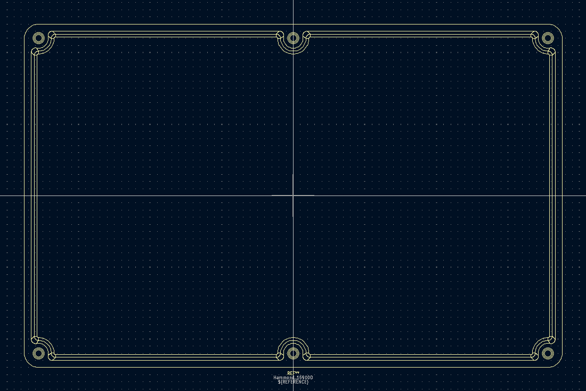
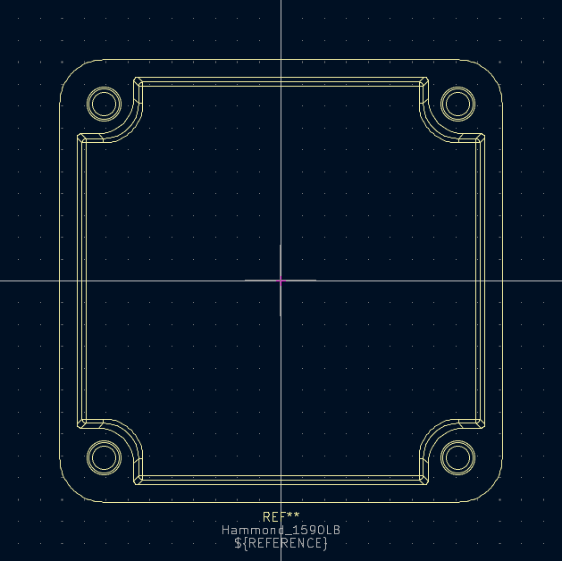
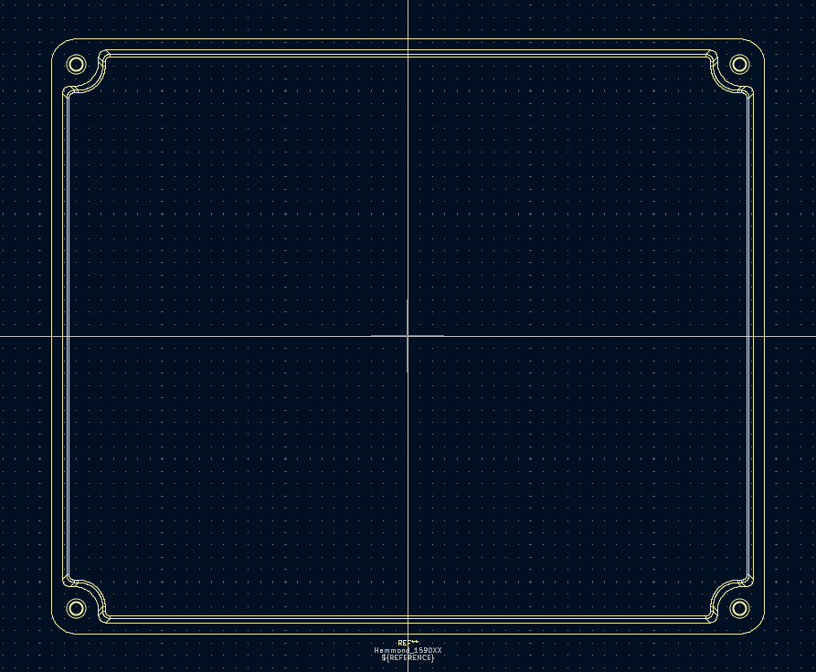

# Common Enclosure KiCAD footprints

This is a [KiCAD](https://www.kicad.org) footprint library containing footprints for many of the standard enclosures used by effect pedal builders, including all of the [metal enclosures](https://www.taydaelectronics.com/hardware/enclosures.html) available on [Tayda Electronics](https://www.taydaelectronics) as of March 2023.

All footprints and 3D models are derived directly from [CAD files](http://www.hammondmfg.com/dwg.htm) available from [Hammond Manufacturing](https://www.hammfg.com/).

*I am not affiliated with any of the brands, sites, or products named in this overview.*

## Notes

 - These footprints are intended for temporary use to "test fit" designs, as suggested in a [thread](https://www.freestompboxes.org/viewtopic.php?p=294358#p294358) on [freestomboxes.org](https://www.freestompboxes.org/index.php). This is, not surprisingly, where I got the idea to build this library.
 - All footprints are drawn on the F.Silkscreen layer, so that they show up in the 3D model viewer. They are not intended to be used in final designs, so this should not be an issue. 
 - While 3D models are included of each enclosure, they're only likely to be useful with further adjustment of the Z-offset to suit your needs. Changing the opacity can be quite useful as well.

## Images

Images of each footprint, included purely to make this landing page less boring.

### 125B / 1590N1

### 1590A

### 1590B

### 1590BB

### 1590BB2

### 1590BX / 1032L

### 1590DD

### 1590LB

### 1590XX

